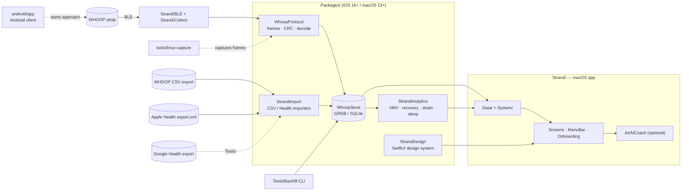

# Architecture

NOOP is a local-first companion for WHOOP straps: platform-pure Swift packages plus a macOS SwiftUI app (`Strand/`) and an Android app. Everything stays on the user's machine.

```mermaid
flowchart LR
    Strap[(WHOOP strap)] -->|BLE| Ble["Strand/BLE + Strand/Collect"]
    CSV[(WHOOP CSV export)] --> Imp
    AH[(Apple Health export.xml)] --> Imp
    GH[(Google Health export)] -.Tools/.-> Imp

    subgraph Packages["Packages/ (iOS 16+ / macOS 13+)"]
        Proto["WhoopProtocol<br/>frames · CRC · decode"]
        Imp["StrandImport<br/>CSV / Health importers"]
        Store[("WhoopStore<br/>GRDB / SQLite")]
        Anal["StrandAnalytics<br/>HRV · recovery · strain · sleep"]
        Des["StrandDesign<br/>SwiftUI design system"]
    end

    subgraph App["Strand/ — macOS app"]
        Screens["Screens · MenuBar · Onboarding"]
        Data["Data/ + System/"]
        AI["AI/AICoach (optional)"]
    end

    Ble --> Proto --> Store
    Imp --> Store
    Store --> Anal
    Store --> Data
    Anal --> Data --> Screens
    Des --> Screens
    Screens --> AI
    Backfill["Tools/Backfill CLI"] --> Store
    Linux["tools/linux-capture"] -.captures frames.-> Proto
    Android["android/app<br/>Android client"] -.same approach.-> Strap
```
